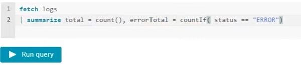
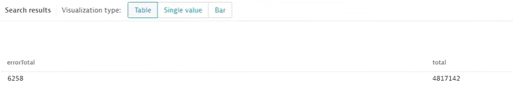
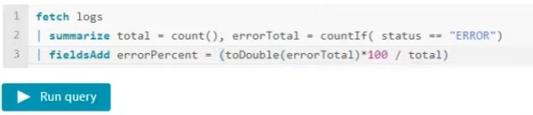
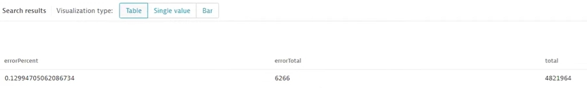
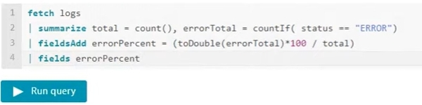
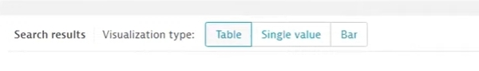

Dynatrace Log Management and Analytics Tutorial<!-- omit in toc -->
=
The purpose of this short tutorial is to present example new capabilities offered by Log Management and Analytics, the latest Dynatrace log solution powered by [Grail](https://www.dynatrace.com/support/help/platform/grail). The use case described below will help you learn how to retrieve the required data from the available logs, how to create a metric based on these data, and how to present the selected results on a Dynatrace dashboard.

# Use case
Let's suppose that you have logs which contain various statuses. You would like to check what kind of statuses there are in the logs, how many of them in each category, and possibly to calculate a percentage of one status category in all relevant logs.

# Extracting data from logs
## Accessing logs
First of all, you should actually see the available logs. To do this:  
1. Go to the Dynatrace menu.
2. Click **Observe and Explore**.
3. Click **Logs**.

Now you are supposed to write a query to access the logs and view the information. There are two query modes: **Simple** and **Advanced**. Because for now you don't know exactly what you'll be looking for, you should select the **Advanced** mode. In this mode, you'll write queries manually with the use of the **Dynatrace Query Language**. Learn more about the syntax and other details of this language in [DQL language reference](https://www.dynatrace.com/support/help/platform/grail/dynatrace-query-language/dql-reference).

## Writing a simple query
The first command you should use is ```fetch```. It serves for loading the resources, which in this case are logs.
1. Write ```fetch```.
2. Enter a space.
3. Write ```logs```.
4. Click **Run query**.


This way you'll see all the available logs in the form a table. If you click on any item in the table, a panel will appear on the right side of the screen, presenting various pieces of information contained in the selected log.

Do you want to narrow down the timeframe of the logs? Simply extend your initial command by writing the example code presented in the screenshot below:


Now you'll see only the logs from the past one hour. If you want to get logs from the past six hours, write ```-6h``` instead of ```-1h```.

But let's get back to the results you obtained. From all the information, you're interested in determining what statuses are contained in the logs. The basic command serving this purpose is called ```summarize```, and in our case it should be modified by the ```count``` function.

* Note: All commands are sequenced by the pipe character (|).

## Extracting information about statuses
1. Place the cursor in the new line.
2. Enter the pipe (|) character.
3. Enter a space.
4. Write ```summarize count(), by: status```.
5. Click **Run query**.


The table now shows all the available statuses and the total quantity of logs with the given status.


## Calculating the number of logs with a specific status
Thanks to the above query you've learned what statuses your logs can have. Now let's suppose that you'd like to know how many logs have the ```error``` status out of the total number of logs. To get this information, you still need to use the ```summarize``` command, but this time the query will be more complex.

1. Delete line 2 of your query.
2. Write ```| summarize total = count(), errorTotal = countIf( status == "ERROR")```.
3. Click **Run query**.



Your table with the results should look like this:


But what has actually happened?  
You created two new variables: ```total``` and ```errorTotal```, which you can see in the table with the results. The ```total``` result is the number of all logs and was calculated by the ```count()``` function. The ```errorTotal``` result, in turn, is the number of all logs with the ```error``` status, calculated by the ```countIf``` function.

## Calculating a percentage
But wait, there's more!
DQL allows you, among others, to calculate the percentage of ```error``` logs in all logs. What you have to do is to add a new command to your query: ```fieldsAdd```.

1. Place the cursor in the new line.
2. Write ```| fieldsAdd errorPercent = (toDouble(errorTotal)*100 / total)```.
3. Click **Run query**.



Now your table contains a new column, with the heading you've just entered in the new line of the query: ```errorPercent```. 



Using DQL, you've created the new result in the form of a double value (```toDouble``` function) by multiplying the ```errorTotal``` value by 100 and then dividing by the ```total``` value.

## Cleaning up the table
If you want some columns disappear from the table, so that it's more legible, you can use the ```fields``` command. It is responsible for showing only the required columns. Remember to modify the command by the name of the column you want.

1. Place the cursor in the new line.
2. Write ```| fields errorPercent```.
3. Click **Run query**.



## Selecting visualization type
If you don't like the current type of visualization of your results, you can easily change it. Simply find the **Visualization type** area just above the table and click **Single value**.



# Creating a metric
Now you can create a metric based on the result of your query. The new metric value can represent an occurrence of log records or an attribute value.
   
1. Make sure that you are in **Logs** in the Dynatrace menu.
2. Select **Create metric**.
3. Append the metric name to the metric key log.
4. Save changes.

Learn more about metrics in [Log metrics](https://www.dynatrace.com/support/help/observe-and-explore/logs/log-management-and-analytics/lma-analysis/lma-log-metrics).

# Presenting the metric on the dashboard
Once you've received the result of your query, you can present it on the dashboard.

1. Find the **Visualization type** area and click **Single value**.
2. Click the **Actions** button located in the right part of the screen.
3. Click **Pin to dashboard**.
4. Click the **Dashboard** field. 
5. Click **Create new dashboard**.
6. Click the **Tile title** field.
7. Enter any name you want for your new tile.
8. Click the **Pin** button.
9. Click the **Open dashboard** button.
10. Click the field with the name starting with **New dashboard**.
11. Enter any name you want for your new dashboard.


